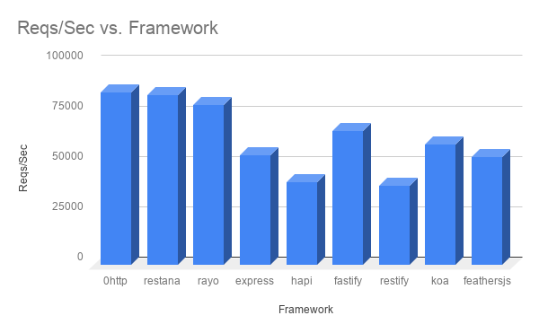

# WeatherTest

simple weather app

## 介绍

本项目使用[Bun.js](https://bun.sh/)作为运行时, 考虑到Node环境，在`devDependencies`中安装了`"bun": "^1.1.33"`。
基于`react-dom` 实现简单的SSR。不过还存在很多问题，包括状态存储、路由、打包优化等

### 初始化

```shell
  bun install
  # 或者
  npm install
```

### 运行

```shell
  bun dev
  # 或者
  npm run dev
```

#### 一些库说明

`0http-bun` 是一个实验性项目，[0http](https://www.npmjs.com/package/0http) 是Node环境下一个 `connect like` http库。相比`Express`, 性能更好，支持 async/await中间件。

`dayjs` 一个时间处理库，`moment.js`的继任者，更轻量

`bun` 一个新生代`Javascript`运行时，更快、原生支持TypeScript、提供更多工具功能。
